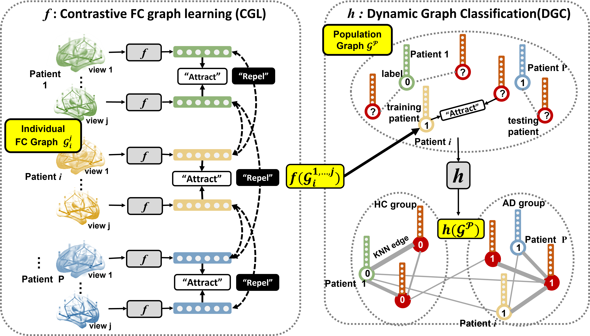

# Contrastive Functional Connectivity Graph Learning for Population-based fMRI Classification
#### Authors: [XueSong Wang](https://xuesongwang.github.io/), [Lina Yao](https://www.linayao.com/), [Islem Rekik](https://basira-lab.com/), [Yu Zhang](http://yuzhangresearch.weebly.com/)

This repo hosts the official implementation of our MICCAI 2022 paper.
<div align="center">

</div>

## Usage
### Setup
**pip**

See the `requirements.txt` for environment configuration. 
```bash
pip install -r requirements.txt
```
**PYG**

To install pyg library, [please refer to the document](https://pytorch-geometric.readthedocs.io/en/latest/notes/installation.html)

### Dataset 
**ABIDE / ADHD200**

We treat each fMRI as a brain graph. How to download and construct the graphs?
```
python preprocessing/abide_01-fetch_data.py
python preprocessing/abide_02-process_data.py
```

### How to run classification?
Training and testing are integrated in file `main_ABIDE.py`. To run
```
python main_ABIDE.py
```
Note: 
1. You need to replace the dataroot in main_ABIDE.py with your path where the dataset.pt is located. 
```
parser.add_argument('--dataroot', type=str, default='/share/scratch/xuesongwang/nilearn_data/ADHD200/AAL90', help='root directory of the dataset')
```
2. If you are trying with your own dataset, indim and nroi should be modified.
```
parser.add_argument('--indim', type=int, default=97, help='feature dim, with PCD information, such as gender, handenss')
parser.add_argument('--nroi', type=int, default=90, help='num of ROIs')
```


## Citation
If you find the code and dataset useful, please cite our paper.
```latex
@article{wang2022contrastive,
  title={Contrastive Graph Learning for Population-based fMRI Classification},
  author={Wang, Xuesong and Yao, Lina and Rekik, Islem and Zhang, Yu},
  journal={arXiv preprint arXiv:2203.14044},
  year={2022}
}
```


## Parameter setting
```
ContraGraphLearning(
  (conv1): ChebConv(206, 64, K=3, normalization=sym)
  (pool1): TopKPooling(64, ratio=0.5, multiplier=1)
  (conv2): ChebConv(64, 64, K=3, normalization=sym)
  (pool2): TopKPooling(64, ratio=0.5, multiplier=1)
  (fc_encoder): Linear(in_features=256, out_features=256, bias=True)
  (bn1): BatchNorm1d(256, eps=1e-05, momentum=0.1, affine=True, track_running_stats=True)
  (contra_encoder): Sequential(
    (0): Linear(in_features=256, out_features=64, bias=False)
    (1): ReLU()
    (2): Linear(in_features=64, out_features=512, bias=True)
  )
)
DynamicGraphClassification(
  (nn1): Sequential(
    (0): Linear(in_features=1024, out_features=64, bias=False)
    (1): BatchNorm1d(64, eps=1e-05, momentum=0.1, affine=True, track_running_stats=True)
    (2): LeakyReLU(negative_slope=0.2)
  )
  (edge_conv1): DynamicEdgeConv(nn=Sequential(
    (0): Linear(in_features=1024, out_features=64, bias=False)
    (1): BatchNorm1d(64, eps=1e-05, momentum=0.1, affine=True, track_running_stats=True)
    (2): LeakyReLU(negative_slope=0.2)
  ), k=20)
  (nn2): Sequential(
    (0): Linear(in_features=128, out_features=64, bias=False)
    (1): BatchNorm1d(64, eps=1e-05, momentum=0.1, affine=True, track_running_stats=True)
    (2): LeakyReLU(negative_slope=0.2)
  )
  (edge_conv2): DynamicEdgeConv(nn=Sequential(
    (0): Linear(in_features=128, out_features=64, bias=False)
    (1): BatchNorm1d(64, eps=1e-05, momentum=0.1, affine=True, track_running_stats=True)
    (2): LeakyReLU(negative_slope=0.2)
  ), k=20)
  (nn3): Sequential(
    (0): Linear(in_features=128, out_features=64, bias=False)
    (1): BatchNorm1d(64, eps=1e-05, momentum=0.1, affine=True, track_running_stats=True)
    (2): LeakyReLU(negative_slope=0.2)
  )
  (edge_conv3): DynamicEdgeConv(nn=Sequential(
    (0): Linear(in_features=128, out_features=64, bias=False)
    (1): BatchNorm1d(64, eps=1e-05, momentum=0.1, affine=True, track_running_stats=True)
    (2): LeakyReLU(negative_slope=0.2)
  ), k=20)
  (concat_fc): Linear(in_features=192, out_features=512, bias=False)
  (mlp1): Sequential(
    (0): Linear(in_features=512, out_features=256, bias=True)
    (1): BatchNorm1d(256, eps=1e-05, momentum=0.1, affine=True, track_running_stats=True)
    (2): LeakyReLU(negative_slope=0.2)
  )
  (mlp2): Sequential(
    (0): Linear(in_features=256, out_features=128, bias=True)
    (1): BatchNorm1d(128, eps=1e-05, momentum=0.1, affine=True, track_running_stats=True)
    (2): LeakyReLU(negative_slope=0.2)
  )
  (clf): Linear(in_features=128, out_features=2, bias=True)
)
```

The best result we have achieved is shown as the following. 

ADHD200 (You can obtain the result by loading the 'CGL_best_encoder.pth' and 'DGC_best_classifier.pth' from saved_model.)
```
         accuracy  sensitivity  specificity       auc
PK       0.792453     0.608696     0.933333  0.844928
KKI      0.666667     0.555556     0.714286  0.613757
NYU      0.614035     0.742857     0.409091  0.661039
Overall  0.692857     0.671642     0.712329  0.740339
```

ABIDE
```
          accuracy  sensitivity  specificity       auc
CALTECH   0.333333     1.000000     0.000000  0.500000
CMU       1.000000     1.000000     1.000000  1.000000
KKI       0.625000     0.000000     1.000000  0.533333
LEUVEN_1  0.500000     0.333333     0.666667  0.555556
LEUVEN_2  0.714286     0.666667     0.750000  0.583333
MAX_MUN   0.600000     0.250000     0.833333  0.583333
NYU       0.600000     0.466667     0.700000  0.553333
OHSU      0.833333     0.666667     1.000000  0.888889
OLIN      0.500000     0.000000     1.000000  1.000000
PITT      0.545455     0.400000     0.666667  0.533333
SBL       1.000000     1.000000     1.000000  1.000000
SDSU      0.333333     0.000000     0.500000  0.500000
STANFORD  0.666667     0.666667     0.666667  0.888889
TRINITY   0.333333     0.000000     0.600000  0.350000
UCLA_1    0.714286     0.750000     0.666667  0.729167
UCLA_2    0.600000     1.000000     0.000000  1.000000
UM_1      0.722222     0.285714     1.000000  0.818182
UM_2      0.750000     0.666667     0.800000  0.866667
USM       0.857143     0.777778     1.000000  0.822222
YALE      0.777778     0.800000     0.750000  0.850000
Overall   0.650794     0.522727     0.762376  0.678555
Number of nodes: 871
Number of edges: 3396
Average node degree: 3.90
Number of training nodes: 590
Training node label rate: 0.68
```


Many thanks to [Dr Xiaoxiao Li](https://xxlya.github.io/xiaoxiao/)
for clearing out my concerns and sharing their project [BrainGNN](https://github.com/LifangHe/BrainGNN_Pytorch/tree/30b78ae28a1e8d6d23004884b6c8e7010bcaf587)  
Also thanks [Dr Sofia Ira Ktena](https://sites.google.com/view/sk1712/home) for providing critical preprocessing steps on FC graphs.
